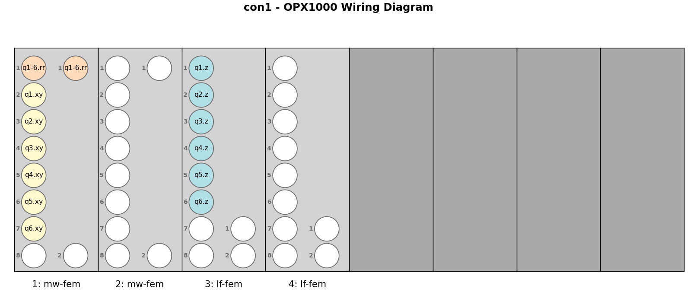

# Creating the QUAM State

This document explains the process of defining, generating, and initializing the Quantum Abstract Machine (QUAM) state, which serves as the central configuration object for your quantum system within the QUAlibrate software ecosystem. The QUAM object holds information about hardware configuration, connectivity, elements (qubits, resonators, etc.), pulses, and operations.

## Folder Contents (`configuration/*`)

The `configuration` library is organized into the following main files and directories:

```text
configuration/
├── create_qualibrate_config.py  # Interactive tool for configuring QUAlibrate
├── make_quam_onthefly.py        # Example with custom QUAM components
├── make_quam.py                 # Builds the QUAM state with its components from the wiring
├── make_wiring_lffem_mwfem.py   # Builds the QUAM wiring for an OPX1000 with MW-FEM and LF-FEM
├── make_wiring_lffem_octave.py  # Builds the QUAM wiring for an OPX1000 with an LF-FEM and Octave
├── make_wiring_opxp_octave.py   # Builds the QUAM wiring for an OPX+ and Octave
├── modify_quam.py               # Populates the QUAM state with known QPU parameters
├── quam_state                   # Default directory for the QUAM state files
│   ├── state.json
│   └── wiring.json
└── README.md                    # This file

```
## Workflow for Creating the QUAM State

The typical workflow to create a QUAM state that accurately represents your quantum setup involves the following steps:

### 1️⃣ Navigate to `configuration/` folder

All relevant scripts reside here.

### 2️⃣ Generate Static Wiring (using `make_wiring_*.py`)

Select which `make_wiring_*` file corresponds with your instrument setup and supply it with:
 - Static parameters (i.e., the IP address, port and cluster name)
 - Location of the `quam_state/` directory which you would like to create
 - Available instrument setup (i.e., which chassis slots the LF-FEMs and MW-FEMs occupy)
 - Qubit and qubit pair indices
 - Desired connections to the QPU (e.g., resonator lines, flux lines, drive lines, coupler lines)

Running this file should result in a schematic of the allocated channels, e.g.,



For advanced instructions on wiring, including hardcoding channels, re-using channels and so on, see **[qualang_tools/wirer/README.md](https://github.com/qua-platform/py-qua-tools/tree/main/qualang_tools/wirer)**

### 3️⃣ Generate Static Components (using `make_quam.py`)

Running this script creates the static part of the QUAM state, primarily, the components which store your QPU parameters.

### 4️⃣ Initialize Dynamic Parameters (using `modify_quam_*.py`)

This step populates the QUAM state file (e.g., `state.json`) created in the previous step with initial operational parameters.

- Edit the script with initial guesses for parameters like qubit/resonator frequencies, pulse amplitudes/durations, gains, etc.. **You must adjust these values** to be reasonable starting points for your specific qubits and setup.
- Run the script to load the existing QUAM state, populate the dynamic parameters based on the script's logic and values, and save the state file (e.g., `state.json`).

## Saving and loading a QUAM state

After completing these steps, your QUAM state is ready. You can load and save it within your Python scripts or calibration nodes using:

```python
# Make sure Quam class is correctly imported from your my_quam.py
from quam_libs.components.quam_root import QuAM

# Load QUAM state (adjust path if needed, otherwise it's taken from the qualibrate config)
machine = QuAM.load()

# Save QUAM state (updates the state file)
machine.save()
```

This populated QUAM state serves as the starting point for running calibrations via QUAlibrate nodes, which will further refine these parameters.
